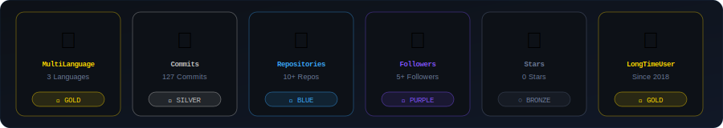

<div align="center">

<!-- LOCAL SVG header — zero external dependency -->


<br/>

<!-- Typing SVG via demolab (most reliable external service) -->
<a href="https://git.io/typing-svg">
  
</a>

<br/><br/>

<!-- Social badges (shields.io — always reliable) -->
<a href="https://linkedin.com/in/YOUR_LINKEDIN_USERNAME">
  
</a>
<a href="https://instagram.com/YOUR_INSTAGRAM_USERNAME">
  
</a>
<a href="https://discordapp.com/users/YOUR_DISCORD_ID">
  
</a>
<a href="mailto:rizki.putra@metrodata.co.id">
  
</a>
<a href="https://github.com/insiderhack">
  
</a>

<br/><br/>


</div>

---

## ⭐ About Me

```yaml
name        : Rizki Perdana Putra
role        : Technical Consulting Manager
company     : Metrodata
location    : Indonesia 🇮🇩
focus       : Data & AI Architecture · Homelab · Scalable Systems
containers  : 20+ running on daily driver
interests   : [Self-Hosting, Open Source, LLMs, DevOps, MLOps]
currently   : Exploring new AI/Data tech stacks
```

---

## 💻 Tech Stack & Expertise

**🖥️ Homelab & Data Analytics**


**📱 Mobile & Backend Core**


**☁️ Infrastructure & DevOps**


---

## 📊 GitHub Stats & Metrics

<div align="center">

<!-- LOCAL SVGs — always render, no external service needed -->

&nbsp;&nbsp;


</div>

<br/>

<div align="center">

<!-- Streak: demolab is the actively maintained version -->


</div>

---

## 🏆 GitHub Trophies

<div align="center">

<!-- LOCAL SVG trophies — fully self-contained -->


</div>

---

## 📈 Contribution Activity

<div align="center">


</div>

---

## 🐍 Contribution Snake

<div align="center">

<picture>
  <source media="(prefers-color-scheme: dark)"
    srcset="https://raw.githubusercontent.com/insiderhack/insiderhack/output/github-contribution-grid-snake-dark.svg" />
  <source media="(prefers-color-scheme: light)"
    srcset="https://raw.githubusercontent.com/insiderhack/insiderhack/output/github-contribution-grid-snake.svg" />
  
</picture>

</div>

<details>
<summary>⚙️ Snake workflow setup (click to expand)</summary>

Create `.github/workflows/snake.yml`:

```yaml
name: Generate Snake

on:
  schedule:
    - cron: "0 0 * * *"
  workflow_dispatch:

jobs:
  generate:
    runs-on: ubuntu-latest
    steps:
      - uses: Platane/snk@v3
        with:
          github_user_name: ${{ github.repository_owner }}
          outputs: |
            dist/github-contribution-grid-snake.svg
            dist/github-contribution-grid-snake-dark.svg?palette=github-dark
      - uses: crazy-max/ghaction-github-pages@v3
        with:
          target_branch: output
          build_dir: dist
        env:
          GITHUB_TOKEN: ${{ secrets.GITHUB_TOKEN }}
```

Go to **Settings → Actions → General → Workflow permissions → Read and write**, then run the workflow once manually.

</details>

---

## 💬 Random Dev Quote

<div align="center">


</div>

---

<div align="center">

<!-- LOCAL SVG footer wave -->


<br/>


&nbsp;


<br/><br/>

**⚡ "The best infrastructure is the one you never have to think about."**

</div>
